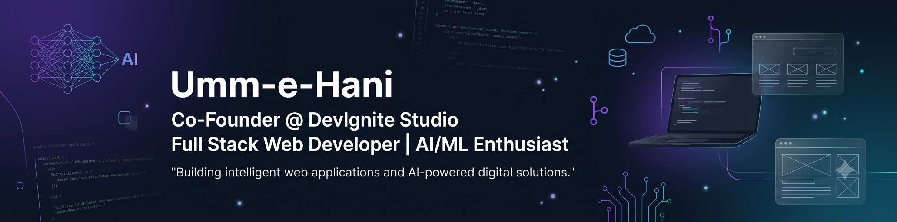

# Umm-e-Hani

**Full Stack Web Developer · AI/ML Enthusiast**
📍 Karachi, Pakistan &nbsp;·&nbsp; 📧 hanikamal700@gmail.com &nbsp;·&nbsp; 📞 +92 309 2461696 &nbsp;·&nbsp; 🌐 [Portfolio](https://ummehani2006.github.io/portfolios)

Detail oriented Full Stack Developer with hands-on experience across front-end, back-end, and AI-powered application development. Delivered real client projects including a worldwide car booking platform and a fully functional e-commerce store, and independently built **ExamMate AI** an AI-powered exam prep platform with ML-based analytics and NLP. Currently deepening full-stack and AI/ML skills through a Diploma in Web Development at Aptech Learning and a BS in Artificial Intelligence at SSUET.

---

## 💼 Experience

### Freelance Web Developer & Project Coordinator
**Self-Employed · Karachi, Pakistan** &nbsp;|&nbsp; *Oct 2024 – Present*

- Designed and developed fully responsive websites with HTML5, CSS3, JavaScript, and PHP — cross-browser, mobile-first
- Delivered a **worldwide car booking platform** (team project) — global browsing by country, online booking, PDF confirmations, second-hand marketplace (PHP + MySQL)
- Delivered a **fashion & beauty e-commerce store** (team project) on WordPress + WooCommerce — full listings, cart, checkout
- Designed all UI/UX layouts from scratch with a focus on clean, intuitive design
- Managed timelines and client milestones via Trello; handled client communication end-to-end

### Sales Representative — Internship
**IJK Media · Karachi, Pakistan** &nbsp;|&nbsp; *Nov 2025 – Jan 2026*

- Communicated service offerings to potential clients clearly and persuasively
- Built negotiation, follow-up, and client relationship management skills in a fast-paced setting

---

## 🛠️ Skills

**Front-End**

`HTML5 / CSS3` 
`JavaScript / TypeScript` 
`React.js` 
`Responsive & UI/UX Design` 

**Back-End**

`PHP / MySQL` 
`Python / Flask` 
`ASP.NET Core / C#` 
`Node.js / MongoDB` 
`RESTful API Integration` 

**AI / Machine Learning**

`AI API Integration (Gemini, Groq, Claude)` 
`NLP-based Feature Development` 
`ML-based Analytics` 

**CMS & E-Commerce**

`WordPress / WooCommerce` 
`SEO Basics` 

**Tools & Platforms**

**Soft Skills**

`Communication` `Teamwork` `Time Management` `Project Management` `Client Handling` `Agile Basics` `Problem Solving`

**Languages** — Urdu (Native) · English (Professional Working Proficiency)

---

## 🚀 Featured Projects

### 🤖 ExamMate AI — AI-Powered Exam Preparation Platform
`Python` `Flask` `Gemini API` `Groq API` `Machine Learning` `NLP`
- Full-stack AI web app integrated with Gemini and Groq APIs for intelligent exam prep
- Automated MCQ generation, past paper solving, AI-based notes summarization, ML-driven performance analytics
- Adaptive quiz logic with API fallback architecture (Groq primary, Claude Haiku fallback) for reliability

### 🚗 Worldwide Car Booking Platform — *Client Project*
`HTML5` `CSS3` `JavaScript` `PHP` `MySQL`
- Global car browsing by country, online booking system, PDF booking confirmation, second-hand car marketplace

### 🛍️ E-Commerce Fashion & Beauty Store — *Client Project*
`WordPress` `WooCommerce` `HTML5` `CSS3`
- Fully functional online store with product listings, cart management, and payment checkout

### 🖼️ Art Gallery Management System
`ASP.NET Core` `C#` `SQL Server`
- Dynamic enterprise web app for managing gallery inventory, artwork details, artist profiles, and exhibitions

### 🎨 Artora — Art Exhibition Platform
`HTML5` `CSS3` `JavaScript`
- Front-end project presented at college exhibition — interactive gallery layout with modern UI/UX

### 🏨 Hotel Booking Website
`HTML5` `CSS3` `JavaScript` `Bootstrap`
- Luxury hotel booking site with room showcase, interactive booking management, and admin panel

### 🦷 Dental Clinic Website
`HTML5` `CSS3` `JavaScript` `Bootstrap`
- Responsive site for a dental clinic with service descriptions, appointment requests, doctor profiles

### 💼 DevIgnite Studio — Digital Studio Website
`HTML5` `CSS3` `JavaScript`
- Personal digital agency portfolio showcasing custom web design & development services

---

## 🎓 Education & Certifications

| Qualification | Institute | Status |
|---|---|---|
| **BS Artificial Intelligence** | Sir Syed University of Engineering & Technology (SSUET) | In Progress |
| **Diploma in Web Development** | Aptech Learning | In Progress |
| **Intermediate (Pre-Medical)** | Private Board | 2025 – 2026 |

**Certifications**
- Basics of Python Programming — UniAthena (UK), 2025
- Basics of Digital Marketing — UniAthena (UK), 2024
- Basics of Multinational Enterprises — UniAthena (UK), 2024

---

## 📊 GitHub Stats

---

## 📫 Connect With Me

